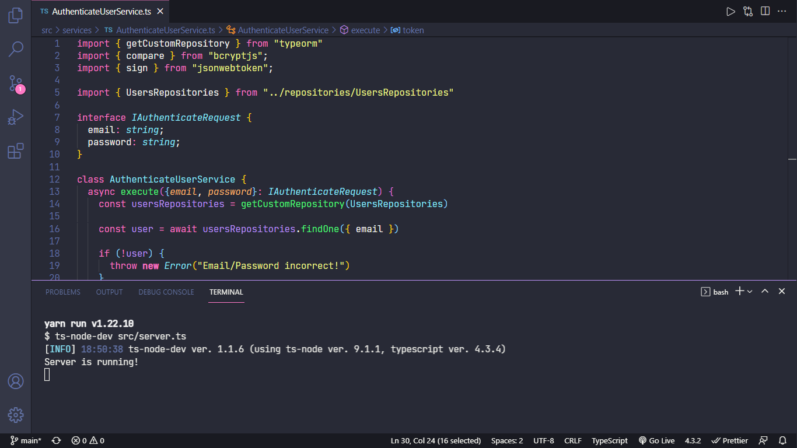

<h1 align="center">nlwValoriza</h1>

<h1 align="center">
  
</h1>

## 🧪 Tecnologias

Esse projeto foi desenvolvido com as seguintes tecnologias:

- [Node.js](https://reactjs.org)
- [TypeScript](https://www.typescriptlang.org/)
- [Express](https://expressjs.com/pt-br/)
- [TypeORM](https://typeorm.io/#/)
- [JWT](https://github.com/auth0/node-jsonwebtoken#readme)

## 🚀 Como executar

Clone o projeto e acesse a pasta do mesmo.

```bash
$ git clone https://github.com/xpedroleonardo/nlwValoriza.git

$ cd nlwValoriza
```

Crie um arquivo <b>.env</b> e coloque um código secreto, para que o JWT funcione, o arquivo <b>.env.example</b> tem um exemplo de como colocar o seu código.

Para iniciá-lo, siga os passos abaixo:

```bash
# Instalar as dependências
$ yarn

# Criar as tabelas do banco de dados.
$ yarn typeorm migration:run

# Iniciar o projeto
$ yarn dev
```

A API estará disponível no endereço http://localhost:3000.

## 💻 Projeto

Valoriza é uma plataforma para promover o reconhecimento entre companheiros de equipe.

## 📝 License

Esse projeto está sob a licença MIT. Veja o arquivo [LICENSE](LICENSE.md) para mais detalhes.

---

Feito com ❤ by [Pedro Leonardo](https://github.com/xpedroleonardo)
